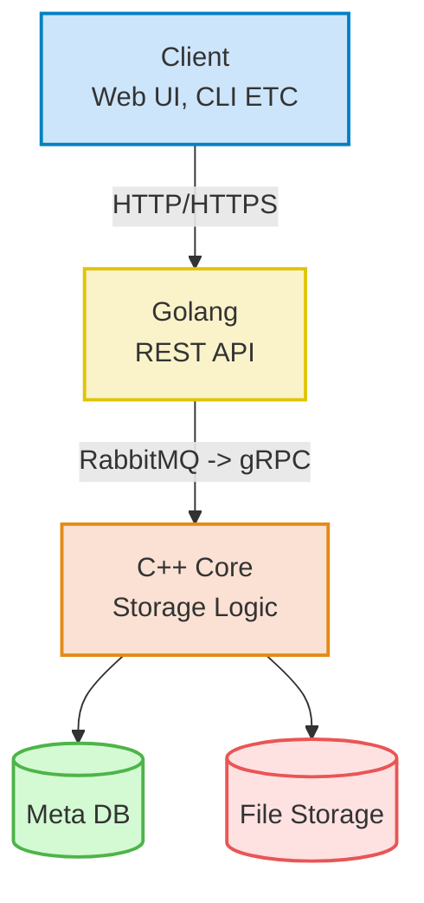
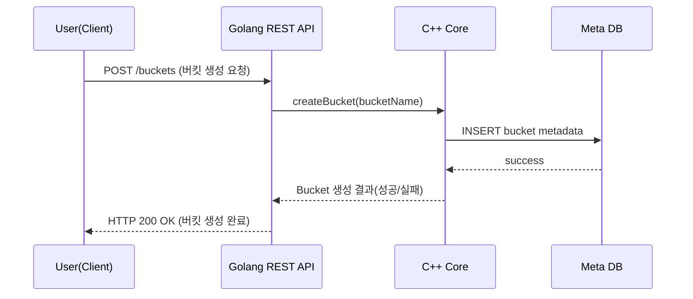
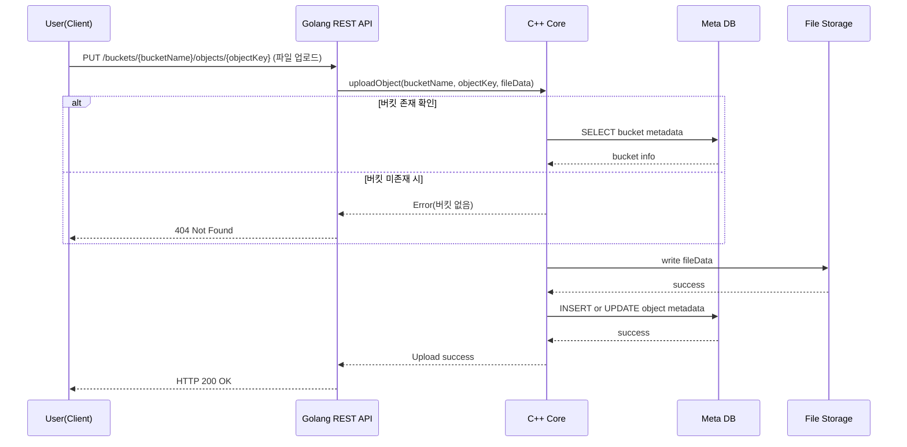
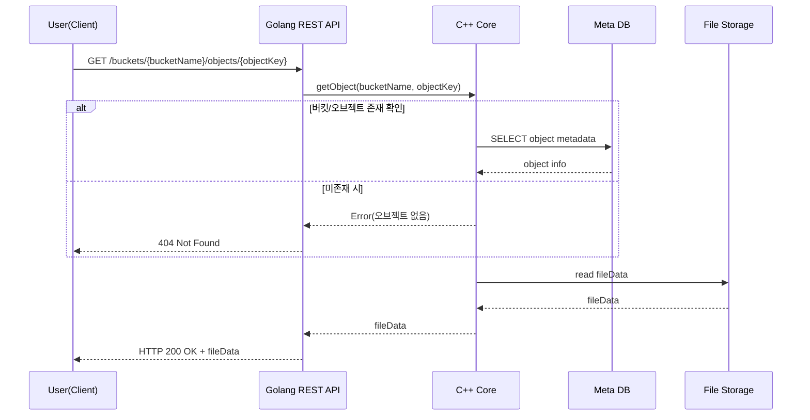

# Simple-Storage-Service
Developing the main functions of AWS S3 in a portfolio format

Developing as simple as possible for demonstration purposes, but developing in a form that is close to practice and adaptable

Developing in MSA format.

Developing with a focus on functionality.

This is an expanded portfolio of the RealtimeMessageChat portfolio. Developing so that it can be applied to practice depending on the user.
---
## Overall architecture (Flowchart)

- **Golang REST API**: Receives HTTP requests from outside and processes them (creates buckets, uploads/downloads objects, etc.)
- Separate interfaces such as separate RestAPIs or Applications are possible
- **C++ Core**: Performs actual storage logic (saves files, processes metadata, etc.)
- Choose C++ because it is fast
- **Meta DB**: Stores buckets and object metadata (RDB or NoSQL)
- Plans to use PostgreSQL, Redis
- **File Storage**: Actual file (object) storage (directory, NAS, or simple block storage, etc.)
- Plans to use a directory

---
### Create Bucket

---
### Upload Object

---
### Download Object

---
### Summary

- Visualize the entire MVP configuration (Client → Golang REST API → C++ Core → DB & File Storage) with **Flowchart**
- Express the flow of main functions (Bucket creation, Object upload, Object download) with **Sequence Diagram**
- Implement the MVP scope (Bucket creation/deletion, Object upload/download, Simple authentication, etc.) step by step based on this structure