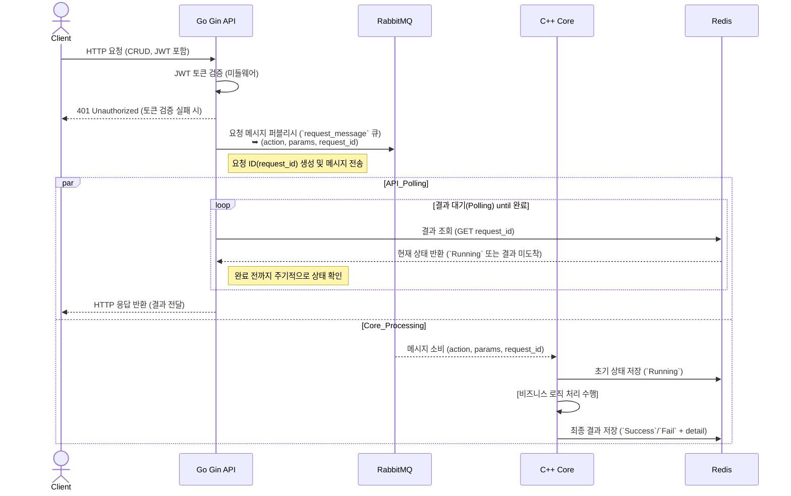

# REST API & C++ 코어 기반 비동기 아키텍처

## 시스템 아키텍처 개요

이 프로젝트는 **Go(Gin 프레임워크)**로 구현된 REST API 서버와 **C++로 작성된 Core 서버**로 구성된 비동기 마이크로서비스 아키텍처입니다. 두 서버는 **RabbitMQ**와 **Redis**를 통해 비동기 메시지 기반으로 통신하며, 클라이언트 요청에 대한 실제 비즈니스 로직 처리는 C++ Core 서버가 담당합니다. 주요 구성 요소는 다음과 같습니다:

- **REST API 서버 (Go/Gin)**: 클라이언트로부터 CRUD 형태의 HTTP 요청을 수신합니다. JWT 인증 미들웨어를 통해 요청의 `Authorization` 헤더를 검증하며, 인증된 요청만 처리합니다. 비즈니스 로직은 직접 수행하지 않고, 요청 데이터를 메시지로 변환하여 RabbitMQ로 전달합니다.
- **RabbitMQ 메시지 브로커**: 비동기 처리를 위한 메시지 큐를 제공합니다. 모든 요청 메시지는 단일 큐 (`request_message`)로 **퍼블리시(Publish)**되며, RabbitMQ는 이를 소비자에게 전달합니다. 이 큐를 통해 REST API 서버와 C++ Core 서버 간의 느슨한 결합과 비동기 통신이 가능해집니다.
- **C++ Core 서버**: RabbitMQ의 `request_message` 큐로부터 메시지를 **소비(Consume)**하는 워커(Worker) 역할을 합니다. 실제 비즈니스 로직(데이터 처리, DB 연동 등)을 수행하고 그 결과나 진행 상태를 Redis에 기록합니다. 다수의 Core 서버 인스턴스를 두어 동시에 여러 메시지를 처리하도록 수평 확장할 수 있습니다.
- **Redis (In-memory DB)**: 작업 결과와 상태를 일시적으로 저장하는 **결과 스토어(Result Store)**로 사용됩니다. C++ Core 서버는 처리 완료 후 결과를 Redis에 기록하며, 키는 요청별 고유 식별자인 `request_id`를 사용합니다. 값은 JSON 형태로 `{ status, detail }` 정보를 포함하고 있으며, REST API 서버는 이를 조회하여 클라이언트에 응답합니다.

이러한 구성으로, REST API 서버는 클라이언트의 요청을 신속히 큐에위임하고, C++ Core 서버는 별도의 프로세스로 무거운 작업을 처리할 수 있습니다. 결과는 Redis를 통해 공유되므로, REST API 서버와 Core 서버가 직접적으로 블로킹되지 않고도 작업 완료 여부를 확인할 수 있습니다.

## 전체 처리 흐름 설명

Go로 구현된 REST API 서버에서 클라이언트 요청을 받아 C++ Core 서버까지 처리되는 **전체 흐름**은 다음과 같습니다:

1. **클라이언트 요청 수신**: 클라이언트가 REST API 서버에 CRUD 요청(예: POST/GET/PUT/DELETE)을 전송합니다. 이때 요청 헤더의 JWT 토큰을 API 서버의 미들웨어에서 검증하여 인증된 사용자만 접근할 수 있도록 합니다. 인증에 성공하면 API 핸들러가 요청을 처리합니다.
2. **요청 메시지 발행**: REST API 서버는 요청을 바로 처리하는 대신, 우선 고유한 `request_id`(예: UUID)를 생성합니다. 그런 다음 요청 내용(예: 수행할 `action`과 관련 `params`)과 `request_id`를 하나의 JSON 메시지로 구성하여 RabbitMQ의 **`request_message` 큐**에 퍼블리시합니다. 이 단계까지는 매우 빠르게 처리되며, API 서버 스레드는 이후 결과를 기다리기 위해 대기 상태로 들어갑니다.
3. **메시지 큐 처리**: RabbitMQ는 `request_message` 큐에 들어온 메시지를 **C++ Core 서버**로 전달합니다. C++ Core 서버는 해당 큐의 **소비자(Consumer)**로 등록되어 있으므로, 큐에 메시지가 생기는 즉시 이를 받아 비즈니스 로직 처리를 시작합니다. 이때 다수의 Core 워커가 있다면 작업이 병렬로 처리될 수 있습니다.
4. **작업 처리 및 진행 상태 업데이트**: C++ Core 서버는 전달받은 메시지의 `action`과 `params`에 따라 실제 작업을 수행합니다. 작업을 시작할 때 우선 Redis에 `request_id`를 키로 하는 **결과 상태 객체**를 하나 생성합니다. 이 객체의 초기 `status`는 `"Running"`으로 설정하고, `detail` 필드에 초기 상태나 진행률 정보를 기록할 수 있습니다. (예: `{ "status": "Running", "detail": "작업 시작됨" }`) 작업이 진행됨에 따라 필요한 경우 Redis의 해당 키에 진행 상황(예: 퍼센트 완료율 또는 중간 결과)을 업데이트할 수 있습니다.
5. **작업 완료 및 결과 저장**: C++ Core 서버의 작업이 완료되면, Redis의 해당 `request_id` 키에 최종 결과를 기록합니다. `status` 필드는 `"Success"` 또는 `"Fail"`로 갱신되고, `detail` 필드에는 결과의 세부 정보나 오류 메시지를 포함합니다. 예를 들어 성공 시 `{ "status": "Success", "detail": "요청 처리 완료 - 생성된 ID: 123" }`과 같이 저장하고, 실패 시 `{ "status": "Fail", "detail": "처리 중 오류 발생" }`과 같이 기록합니다. 기록을 마친 후 Core 서버 측에서는 해당 작업 처리를 종료합니다.
6. **API 서버의 결과 폴링(Polling)**: REST API 서버는 RabbitMQ에 메시지를 퍼블리시한 후, 클라이언트 응답을 바로 보내지 않고 **폴링 방식**으로 Redis를 주기적으로 조회합니다. API 서버는 일정한 간격으로 Redis에 `request_id` 키가 존재하는지, 그리고 `status`가 `"Success"` 또는 `"Fail"`로 변경되었는지 확인합니다. `status`가 여전히 `"Running"`인 경우에는 잠시 대기한 후 다시 조회를 반복합니다. 이렇게 함으로써 API 서버는 비동기 처리를 수행하면서도 클라이언트에 대한 응답을 보류하고 있습니다.
7. **클라이언트 응답 반환**: Redis에 최종 결과(`"Success"` 또는 `"Fail"`)가 기록되면, REST API 서버는 폴링을 중단하고 해당 데이터를 가져옵니다. 가져온 결과 JSON을 해석하여 HTTP 응답 객체를 구성한 뒤, 원래 요청을 보낸 클라이언트에게 최종 응답을 반환합니다. 이 응답에는 요청 처리 결과(예: 생성된 리소스 ID 또는 처리 성공/실패 메시지 등)가 포함됩니다. 이제 클라이언트는 요청에 대한 처리가 완료되었음을 응답을 통해 알게 됩니다.

요약하면, **클라이언트 -> (JWT 인증) -> REST API -> RabbitMQ -> C++ Core -> Redis -> REST API -> 클라이언트**의 흐름으로 진행됩니다. REST API 서버는 내부적으로 비동기로 동작하지만 클라이언트 측에서는 동기적인 HTTP 응답처럼 보이도록 설계되었습니다. 이를 통해 무거운 작업을 백엔드에서 처리하면서도 클라이언트에게 최종 결과를 제공할 수 있습니다.

## 메시지 스키마 예시

아래는 RabbitMQ로 전달되는 **요청 메시지**와 Redis에 저장되는 **응답 메시지**의 JSON 스키마 예시입니다. 이러한 메시지 구조를 통해 시스템 간에 데이터가 표준화된 형식으로 교환됩니다.

- **RabbitMQ 요청 메시지 (예시)**: REST API 서버가 RabbitMQ 큐에 퍼블리시하는 JSON 형식의 메시지입니다. `action`에는 수행할 작업 종류를, `params`에는 작업에 필요한 세부 파라미터를 담고, `request_id`에는 요청 식별자를 포함합니다.
    
    ```json
    {
      "action": "createUser",
      "params": {
        "name": "홍길동",
        "email": "hong@example.com"
      },
      "request_id": "123e4567-e89b-12d3-a456-426614174000"
    }
    
    ```
    
- **Redis 응답 메시지 (예시)**: C++ Core 서버가 처리 결과를 Redis에 저장하는 JSON 형식의 데이터입니다. 키는 해당 요청의 `request_id`이고, 값은 `status`와 `detail` 필드를 포함합니다. 초기에는 `"Running"` 상태로 두고, 완료 시 `"Success"` (또는 `"Fail"`)로 상태를 변경하며 상세 내용을 기술합니다.
    
    ```json
    {
      "status": "Success",
      "detail": "신규 사용자 계정 생성 완료 (ID: 42)"
    }
    
    ```
    
    위 예시는 성공적으로 처리된 경우이며, 실패 시에는 `"status": "Fail"`, `"detail"`에 오류 원인이나 스택 트레이스 요약 등을 담을 수 있습니다. Redis에 저장된 이 JSON 데이터를 REST API 서버가 조회하여 클라이언트에게 그대로 또는 가공하여 전달합니다.

## 시스템 시퀀스 다이어그램

아래 Mermaid 시퀀스 다이어그램은 **클라이언트 -> API -> RabbitMQ -> Core -> Redis**로 이어지는 전체 흐름을 시각화한 것입니다. 다이어그램에는 JWT 인증 과정, 요청 메시지의 큐 전달, Core 서버의 처리 및 결과 저장, 그리고 API 서버의 폴링 및 응답 반환 과정이 순서대로 나타나 있습니다.



위 다이어그램에서 볼 수 있듯이, API 서버는 RabbitMQ에 메시지를 보낸 후 **병렬로** Redis를 폴링하며 결과를 기다리고, 그 사이에 C++ Core 서버는 RabbitMQ로부터 메시지를 받아 작업을 처리합니다. Core 서버의 처리가 끝나면 Redis에 결과가 기록되고, API 서버의 폴링 루프가 이를 감지하여 클라이언트에게 응답을 반환합니다. (JWT 토큰 검증 실패 시에는 즉시 401 응답을 반환하고 흐름이 중단됩니다.)

## 향후 확장 가능성

현재 구현은 **MVP** 수준으로 동작하며, 추후 요구사항 증가나 트래픽 증가에 따라 쉽게 확장될 수 있도록 설계되었습니다. 아래는 향후 확장 또는 개선 가능성에 대한 간단한 요약입니다:

- **수평 확장(Scalability)**: RabbitMQ를 사용한 비동기 구조 덕분에 REST API 서버와 C++ Core 서버를 각각 다중 인스턴스로 늘려 수평 확장할 수 있습니다. 예를 들어, RabbitMQ `request_message` 큐를 동시에 소비하는 Core 워커 프로세스를 추가하면 더 많은 요청을 병렬로 처리할 수 있습니다. Redis는 메모리 기반이라 높은 처리량에도 빠른 응답을 제공하며, 필요시 클러스터링으로 확장 가능합니다.
- **실시간 응답 개선**: 현재는 REST API 서버가 폴링 방식으로 Redis를 조회하지만, 향후에는 **이벤트 기반**으로 개선할 수 있습니다. 예를 들어 WebSocket을 통해 클라이언트에게 진행 상황을 푸시하거나, RabbitMQ의 **Direct Reply-To** 기능이나 별도의 응답 큐를 활용하여 작업 완료 시 API 서버가 즉시 통지를 받는 구조로 변경할 수 있습니다. 이를 통해 폴링으로 인한 지연과 부하를 줄일 수 있습니다.
- **메시지 프로토콜 및 스키마 확장**: `action` 종류를 늘리거나 `params` 구조를 복잡하게 변경하여도, RabbitMQ를 통한 메시징 기반이므로 시스템 간 결합에 큰 영향이 없습니다. 새로운 기능 추가 시 해당 메시지 스키마에 필드를 추가하거나 버전 관리를 통해 유연하게 대처할 수 있습니다. 또한 현재 JSON 기반 메시지를 Avro, Protocol Buffers 등 **직렬화 포맷**으로 교체하여 성능과 타입 안전성을 향상시킬 수도 있습니다.
- **보안 및 인증 강화**: JWT 인증은 현재 미들웨어에서 토큰의 유효성 정도만 검사하는 **MVP 수준**으로 구현되어 있습니다. 추후에는 RBAC(역할 기반 접근 제어) 적용이나 토큰 갱신(리프레시 토큰) 등 보안 기능을 강화할 수 있습니다. 또한 RabbitMQ와 Redis 간 전송되는 데이터에 대해 **암호화**(예: TLS)나 **인증**을 추가로 적용하여 전반적인 시스템 보안을 향상시킬 수 있습니다.
- **모니터링 및 장애 대응**: RabbitMQ, Redis, Core 서버의 상태를 모니터링하고 로깅/알림 체계를 구축하여 장애 상황에 대비할 수 있습니다. 예를 들어 RabbitMQ에 쌓인 대기 메시지 개수로 시스템 부하를 파악하거나, Redis의 키 보관 기간을 정해 메모리 누수를 방지할 수 있습니다. 또한 요청 처리 시간이 오래 걸리는 경우를 대비해 **타임아웃** 설정 및 오류 처리 로직을 추가하여 시스템의 견고성을 높일 수 있습니다.

이와 같이 본 아키텍처는 현재 요구사항을 만족하면서도, 향후 기능 추가나 성능 확장을 유연하게 수용할 수 있도록 설계되었습니다. 각 컴포넌트가 역할에 따라 분리되어 있기 때문에 변경 영향 범위가 적고, 추가 개발 시에도 기존 시스템에 큰 충격 없이 기능을 확장해 나갈 수 있습니다.